<h3><code>norman@github ~ $ whoami</code></h3>

<table>
<tr>
<td valign="middle"></td>
<td valign="middle"></td>
</tr>
</table>

 

 
 

<h3><code>norman@github ~ $ ./links.sh</code></h3>

<b>Full Stack Developer · Databases · Cloud</b>

 

<h3><code>norman@github ~ $ ./contributions.sh</code></h3>

 
 

### `norman@github ~ $ ./open-source.sh`

Reproduce the bug. Measure it. Ship the smallest diff that fixes the cause. Put the evidence in the PR.

| Project | Change | Status |
|---|---|---|
| [joinmarket-webui/jam](https://github.com/joinmarket-webui/jam) | [#1473](https://github.com/joinmarket-webui/jam/pull/1473) Show wait time in days and hours, with unit tests | Merged |
| [libredb/libredb-studio](https://github.com/libredb/libredb-studio) | [#605](https://github.com/libredb/libredb-studio/pull/605) Spanish README covered by the localized-README drift guard | Merged |
| [freeCodeCamp/freeCodeCamp](https://github.com/freeCodeCamp/freeCodeCamp) | [#69935](https://github.com/freeCodeCamp/freeCodeCamp/pull/69935) Align the `javascript-v9` intro block order with the curriculum structure | Merged |
| [meshery/meshery](https://github.com/meshery/meshery) (CNCF) | [#21734](https://github.com/meshery/meshery/pull/21734) and [#21735](https://github.com/meshery/meshery/pull/21735) Responsive UI fixes with a measured root cause | In review |

### `norman@github ~ $ ./projects.sh`

| Project | What it does | Stack |
|---|---|---|
| [**EcoPulse**](https://github.com/NormanSMA/EcoPulse) · [live](https://ecopulse-eta-two.vercel.app) | Real-time environmental and seismic monitor on a map. | Next.js, MapLibre GL, Supabase PostGIS |
| [**Turno**](https://github.com/NormanSMA/turno) · [live](https://turno-umber.vercel.app) | Capacity-based admission for campus food pre-orders. Undergraduate thesis project. | Next.js, Prisma, PostgreSQL, PWA |

### `norman@github ~ $ ./stack.sh`

### `norman@github ~ $ ./now.sh`

- Finishing Information Systems Engineering at Universidad Americana (UAM), Managua. Graduating December 2026.
- Looking for a junior or internship role in full stack, cloud or DevOps. Remote or on site.
- Contributing to open source: CNCF Meshery, LibreDB Studio and others.
- Languages: Spanish (native), English (B2).
